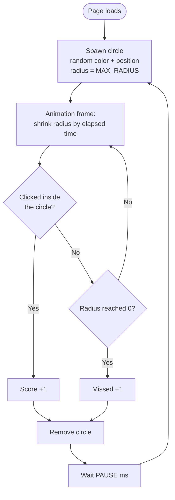

# Circle Click

A small reaction game. Circles with a random color appear at random positions and shrink to nothing. Click (or tap) a circle before it disappears to score a point.

## How to play

Open `index.html` in a browser. No build step or server needed.

- Click a circle before it shrinks to 0 → **Score +1**
- Let it shrink to 0 → **Missed +1**
- A new circle appears shortly after either outcome.

## Files

| File         | Purpose                                      |
| ------------ | -------------------------------------------- |
| `index.html` | Page structure: score bar and game field     |
| `style.css`  | Dark theme, top bar, round circles           |
| `script.js`  | Game logic: spawning, shrinking, scoring     |

## Settings

Tweak these constants at the top of `script.js`:

| Constant      | Default | Meaning                                  |
| ------------- | ------- | ---------------------------------------- |
| `MAX_RADIUS`  | `70`    | Starting radius of each circle, in px    |
| `SHRINK_TIME` | `1000`  | Time for a circle to shrink to 0, in ms  |
| `PAUSE`       | `400`   | Delay before the next circle, in ms      |

## Game flow

